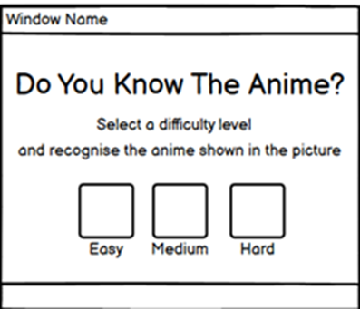
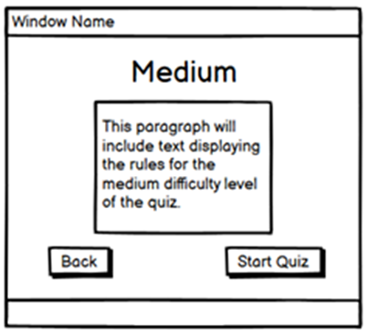

# Anime Quiz

## Site Goals

The goal of this site is to create an engaging and fun way for anime fans to test their knowledge of iconic characters from popular anime series.
<br>

By offering multiple difficulty levels, the site aims to challenge both beginners and seasoned fans, helping them learn more about anime while enjoying a dynamic quiz experience.
<br>

View the live site [here](https://ilyas355.github.io/AnimeQuiz/)

## Features

### Site Wide


### Landing Page


### Easy Rules Page


### Medium Rules Page


### Hard Rules Page


### Quiz Page


### Final Page


### Existing Features


## Design

### Wireframes

<br>

Landing Page

<br>



<br>

Easy Rules page

<br>


<br>

Medium Rules Page

<br>



<br>

Hard Rules Page

<br>


<br>

Easy Quiz Page

<br>


<br>

Medium Quiz Page

<br>


<br>

Hard Quiz Page

<br>


<br>

Final Page

<br>


## Technologies

* HTML
    * The structure of the Website was developed using HTML as the main language.
* CSS
    * The Website was styled using custom CSS in an external file.
* Gitpod
    * The website was developed using Gitpod Code IDE
* GitHub
    * Source code is hosted on GitHub and delpoyed using Git Pages.
* Git 
    * Used to commit and push code during the development opf the Website
* Font Awesome
    * Icons obtained from https://fontawesome.com/ were used as the Social media links in the footer section. 
* Tinyjpg
    * https://tinyjpg.com/ was used to reduce the size of the images used throughout the website
* Favicon.io
    * favicon files were created at https://favicon.io/favicon-converter/ 
* balsamiq
    * wireframes were created using balsamiq from https://balsamiq.com/wireframes/desktop/#


## Testing

### Browser Compatibility

| Browser tested  | Intended apperance | Intended responsiveness |
| --------------- | ------------------ | ----------------------- |
| Microsoft Edge  |        Good        |           Good          |   
| Chrome          |        Good        |           Good          |
| Firefox         |        Good        |           Good          |


### Tools Testing

* [Microsoft Edge](https://learn.microsoft.com/en-us/microsoft-edge/devtools-guide-chromium/overview)

    - Microsoft Edge dev tools was used during the development process to test, explore and modify HTML elements and CSS styles used in the project.

* Responsiveness

    - [Microsoft Edge](https://learn.microsoft.com/en-us/microsoft-edge/devtools-guide-chromium/overview) was used to check responsivity throughout the project.
 
* Accesibility
    - [Google Chrome Developer Tools](https://developer.chrome.com/docs/devtools/) was used for generating the lighthouse report and further reccomended documentation was utilised to increase the score.


### Accessibility
[Wave Accessibility](https://wave.webaim.org/) tool was used throughout development and for final testing of the deployed website to check for any aid accessibility testing.

Testing was focused to ensure the following criteria were met:

- All forms have associated labels or aria-labels so that this is read out on a screen reader to users who tab to form inputs
- Color contrasts meet a minimum ratio as specified in [WCAG 2.1 Contrast Guidelines](https://www.w3.org/WAI/WCAG21/Understanding/contrast-minimum.html)
- Heading levels are not missed or skipped to ensure the importance of content is relayed correctly to the end user
- All content is contained within landmarks to ensure ease of use for assistive technology, allowing the user to navigate by page regions
- All not textual content had alternative text or titles so descriptions are read out to screen readers
- HTML page lang attribute has been set
- Aria properties have been implemented correctly
- WCAG 2.1 Coding best practices being followed

Manual tests were also performed to ensure the website was accessible as possible and an accessibility issue was identified.


### Lighthouse testing


### Functional Testing


### Responsiveness

All pages were tested to ensure responsiveness on screen sizes from 320px and upwards as defined in [WCAG 2.1 Reflow criteria for responsive design](https://www.w3.org/WAI/WCAG21/Understanding/reflow.html) on Chrome, Edge, Firefox and Opera browsers.

| Device tested      | Site responsive >=700px | Site responsive <699px  |   Renders as expected   |
| ------------------ | ----------------------- | ----------------------- | ----------------------- |
| Iphone SE          |           N/A           |           Good          |           Good          |   
| Iphone XR          |           N/A           |           Good          |           Good          |
| Pixel 7            |           N/A           |           Good          |           Good          |
| Samsung Galaxy S8+ |           N/A           |           Good          |           Good          |
| iPad Mini          |           Good          |           N/A           |           Good          |
| Surface Pro 7      |           Good          |           N/A           |           Good          |
| Nest Hub Max       |           Good          |           N/A           |           Good          |
| Asus Zenbook Fold  |           Good          |           N/A           |           Good          |


### Validator Testing 


## Deployment

### Version Control

The site was created using the Visual Studio code editor and pushed to github to the remote repository ‘tacos-travels’.

The following git commands were used throughout development to push code to the remote repo:

```git add <file>``` - This command was used to add the file(s) to the staging area before they are committed.

```git commit -m “commit message”``` - This command was used to commit changes to the local repository queue ready for the final step.

```git push``` - This command was used to push all committed code to the remote repository on github.


### Deployment to Github Pages

- The site was deployed to GitHub pages. The steps to deploy are as follows: 
  - In the GitHub repository, navigate to the Settings tab 
  - From the menu on left select 'Pages'
  - From the source section drop-down menu, select the Branch: main
  - Click 'Save'
  - A live link will be displayed in a green banner when published successfully. 
  
The live link can be found here - https://ilyas355.github.io/AnimeQuiz/


### Clone the Repository Code Locally

Navigate to the GitHub Repository you want to clone to use locally:

- Click on the code drop down button
- Click on HTTPS
- Copy the repository link to the clipboard
- Open your IDE of choice (git must be installed for the next steps)
- Type git clone copied-git-url into the IDE terminal

The project will now of been cloned on your local machine for use.

## Credits


### Content


### Media