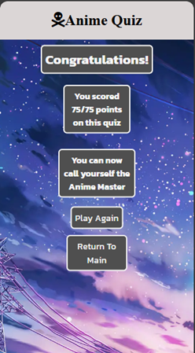
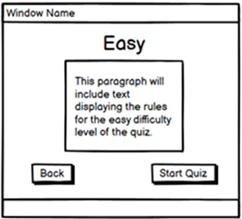
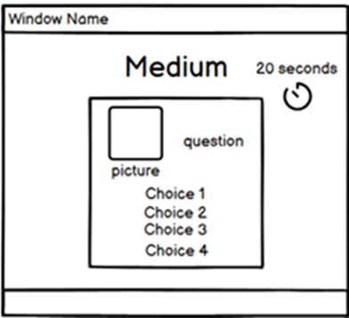
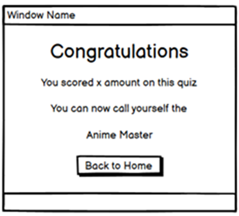

# Anime Quiz

## Site Goals


The goal of this site is to create an engaging and fun way for anime fans to test their knowledge of iconic characters from popular anime series.
<br>

By offering multiple difficulty levels, the site aims to challenge both beginners and seasoned fans, helping them learn more about anime while enjoying a dynamic quiz experience.
<br>

View the live site [here](https://ilyas355.github.io/AnimeQuiz/)


## Features

### Site Wide


* Header
    * Comprised of the name of the game and a gray background
    * Informs the user what the website is about along with providing an appealing aesthetic look to the page


* Favicon
    * A site wide favicon iimplemented with an anime skull fag.
    * This will provide an image in the the tabs header to allow the user to easily identify the website if they have multiple tabs open.


### Landing Page


* Title 1
    * This title asks the user if they know Anime.
    * The purpose of this title is to attract users to the page and enjoy the quiz.

* Title 2
    * The second title prompts the user to select a difficulty level for the quiz they would like to play.
    * The purpose of this title is to help users to understand what the buttons below are for so that the can continue with the quiz.
* Easy Button
    * The easy button redirects the user to the easy rules page.
    * This buttons redirects the user to the easy rules page so that they can understand the rules of the quiz before starting. 
* Medium Button
    * The medium button redirects the user to the medium rules page.
    * This buttons redirects the user to the medium rules page so that they can understand the rules of the quiz before starting. 
* Hard Button
    * The hard button redirects the user to the hard rules page.
    * This buttons redirects the user to the hard rules page so that they can understand the rules of the quiz before starting. 


### Easy Rules Page


* Title
    * The title informs the user the level of the quiz the rules below are for.
    * The helps the user match the rules of the quiz with the difficulty level.

* Rules Box
    * The rules box contains the rules for the quiz the user is about to start. 
    * This informs the user how much time they have for the quiz and how to maximise the points they can get from each round.

* Back Button
    * The back button redirects the user back to the landing page.
    * This gives the user the option to go back and change the difficulty level for the quiz.

* Start Quiz Button
    * The start quiz button begins the quiz with the easy difficulty level when clicked.
    * This allows the user to swiftly begin the quiz upon understanding the rules.


### Medium Rules Page


* Title
    * The title informs the user the level of the quiz the rules below are for.
    * The helps the user match the rules of the quiz with the difficulty level.

* Rules Box
    * The rules box contains the rules for the quiz the user is about to start. 
    * This informs the user how much time they have for the quiz and how to maximise the points they can get from each round.

* Back Button
    * The back button redirects the user back to the landing page.
    * This gives the user the option to go back and change the difficulty level for the quiz.

* Start Quiz Button
    * The start quiz button begins the quiz with the medium difficulty level when clicked.
    * This allows the user to swiftly begin the quiz upon understanding the rules.

### Hard Rules Page


* Title
    * The title informs the user the level of the quiz the rules below are for.
    * The helps the user match the rules of the quiz with the difficulty level.

* Rules Box
    * The rules box contains the rules for the quiz the user is about to start. 
    * This informs the user how much time they have for the quiz and how to maximise the points they can get from each round.

* Back Button
    * The back button redirects the user back to the landing page.
    * This gives the user the option to go back and change the difficulty level for the quiz.

* Start Quiz Button
    * The start quiz button begins the quiz with the hard difficulty level when clicked.
    * This allows the user to swiftly begin the quiz upon understanding the rules.

### Quiz Page - Easy


* Title
    * The title tells the user the difficulty level of the quiz that's being displayed.
    * This allows the user to know the difficulty level for the quiz they are currently on.
* Timer
    * The timer displayed on the screen starts from 15 seconds and decrements every second until the round is over.
    * Allows the user to know how much time they currently have left of the quiz.
* Image
    * The image displayed on the screen displays a character from an anime programme.
    * This is shown so that the user can guess what character it is using the optioms below.
* Quiz Question
    * The question asks the user what the name of the character being displayed is so that the user can select an option.
    * This prompts the user to select an option to decide what character is currently being displayed on the screen.
* Option Box
    * The option box is comprised of 4 different options with 3 wrong answers and 1 right answer.
    * The options allow the user to select what character they think is being displayed on the screen and begins a new round when any one of the options are seleceted.

* Hint Button
    * The hint button displays a box containing a hint to what anime the character is from to help the user identify what the character's name is.
    * This gives the user the option of reading a hint to help identify who the character is. 

### Quiz Page - Medium


* Title
    * The title tells the user the difficulty level of the quiz that's being displayed.
    * This allows the user to know the difficulty level for the quiz they are currently on.
* Timer
    * The timer displayed on the screen starts from 10 seconds and decrements every second until the round is over.
    * Allows the user to know how much time they currently have left of the quiz.
* Image
    * The image displayed on the screen displays a character from an anime programme.
    * This is shown so that the user can guess what character it is using the optioms below.
* Quiz Question
    * The question asks the user what the name of the character being displayed is so that the user can select an option.
    * This prompts the user to select an option to decide what character is currently being displayed on the screen.
* Option Box
    * The option box is comprised of 4 different options with 3 wrong answers and 1 right answer.
    * The options allow the user to select what character they think is being displayed on the screen and begins a new round when any one of the options are seleceted.

### Quiz Page - Hard


* Title
    * The title tells the user the difficulty level of the quiz that's being displayed.
    * This allows the user to know the difficulty level for the quiz they are currently on.
* Timer
    * The timer displayed on the screen starts from 7 seconds and decrements every second until the round is over.
    * Allows the user to know how much time they currently have left of the quiz.
* Image
    * The image displayed on the screen displays a character from an anime programme.
    * This is shown so that the user can guess what character it is using the optioms below.
* Quiz Question
    * The question asks the user what the name of the character being displayed is so that the user can select an option.
    * This prompts the user to select an option to decide what character is currently being displayed on the screen.
* Option Box
    * The option box is comprised of 4 different options with 3 wrong answers and 1 right answer.
    * The options allow the user to select what character they think is being displayed on the screen and begins a new round when any one of the options are seleceted.

### Final Page



* Title
    * Congratulates the user for completing the quiz
    * Gives the user a positive message after completing the quiz to improve the user's experience.

* Title 2
    * Displays the total points the user scored on the quiz.
    * Allows the user to know their results from the quiz they took.
* Title 3
    * Displays 1 of 3 messages based on the number of points they recieved out of 75.
    * Adds to the user experience factor of the quiz and acts as a final message to the user.
* Play Again Button
    * Restarts the quiz with the same difficulty the user selected.
    * Gives the user a shortcut to try again with the same difficulty.
* Return To Main
    * Redirects the user to the landing page.
    * Gives the user the option to select a different difficulty level of the quiz.

### Existing Features

* Landing Page to select difficulty level
* Rules Page for each difficulty level
* Functioning quiz for each difficulty
* Final page displaying the results


## Design

### Wireframes

<br>

Landing Page

<br>


<br>

Easy Rules page

<br>



<br>

Medium Rules Page

<br>


<br>

Hard Rules Page

<br>


<br>

Easy Quiz Page

<br>


<br>

Medium Quiz Page

<br>



<br>

Hard Quiz Page

<br>


<br>

Final Page

<br>




## Technologies

* HTML
    * The structure of the Website was developed using HTML as the main language.
* CSS
    * The Website was styled using custom CSS in an external file.
* Gitpod
    * The website was developed using Gitpod Code IDE
* GitHub
    * Source code is hosted on GitHub and delpoyed using Git Pages.
* Git 
    * Used to commit and push code during the development opf the Website
* Font Awesome
    * Icons obtained from https://fontawesome.com/ were used as the Social media links in the footer section. 
* Tinyjpg
    * https://tinyjpg.com/ was used to reduce the size of the images used throughout the website
* Favicon.io
    * favicon files were created at https://favicon.io/favicon-converter/ 
* balsamiq
    * wireframes were created using balsamiq from https://balsamiq.com/wireframes/desktop/#
* Canva
    * This was used to create the logo in header and make the images for cards 


## Testing

### Browser Compatibility

| Browser tested  | Intended apperance | Intended responsiveness |
| --------------- | ------------------ | ----------------------- |
| Microsoft Edge  |        Good        |           Good          |   
| Chrome          |        Good        |           Good          |
| Firefox         |        Good        |           Good          |


<br>

### Tools Testing

* [Microsoft Edge](https://learn.microsoft.com/en-us/microsoft-edge/devtools-guide-chromium/overview)

    - Microsoft Edge dev tools was used during the development process to test, explore and modify HTML elements and CSS styles used in the project.

* Responsiveness

    - [Microsoft Edge](https://learn.microsoft.com/en-us/microsoft-edge/devtools-guide-chromium/overview) was used to check responsivity throughout the project.
 
* Accesibility
    - [Google Chrome Developer Tools](https://developer.chrome.com/docs/devtools/) was used for generating the lighthouse report and further reccomended documentation was utilised to increase the score.


<br>

### Accessibility
[Wave Accessibility](https://wave.webaim.org/) tool was used throughout development and for final testing of the deployed website to check for any aid accessibility testing.

Testing was focused to ensure the following criteria were met:

- All forms have associated labels or aria-labels so that this is read out on a screen reader to users who tab to form inputs
- Color contrasts meet a minimum ratio as specified in [WCAG 2.1 Contrast Guidelines](https://www.w3.org/WAI/WCAG21/Understanding/contrast-minimum.html)
- Heading levels are not missed or skipped to ensure the importance of content is relayed correctly to the end user
- All content is contained within landmarks to ensure ease of use for assistive technology, allowing the user to navigate by page regions
- All not textual content had alternative text or titles so descriptions are read out to screen readers
- HTML page lang attribute has been set
- Aria properties have been implemented correctly
- WCAG 2.1 Coding best practices being followed

Manual tests were also performed to ensure the website was accessible as possible.


<br>

### Manual Testing


<table>
    <tr>
        <th>Feature</th>
        <th>Outcome</th>
        <th>Example</th>
        <th>Pass/Fail</th>
    </tr>
    <tr>
        <td>Easy Button</td>
        <td>Validate if the easy button displays the easy rules page</td>
        <td></td>
        <td>Pass</td>
    </tr>
    <tr>
        <td>Medium Button</td>
        <td>Validate if the medium button displays the medium rules page</td>
        <td></td>
        <td>Pass</td>
    </tr>
    <tr>
        <td>Hard Button</td>
        <td>Validate if the hard button displays the hard rules page</td>
        <td></td>
        <td>Pass</td>
    </tr>
    <tr>
        <td>Back Button</td>
        <td>Validate if the back button for the easy rules page  displays the landing page</td>
        <td></td>
        <td>Pass</td>
    </tr>
    <tr>
        <td>Back Button</td>
        <td>Validate if the back button for the medium rules page  displays the landing page</td>
        <td></td>
        <td>Pass</td>
    </tr>
    <tr>
        <td>Back Button</td>
        <td>Validate if the back button for the hard rules page displays the landing page</td>
        <td></td>
        <td>Pass</td>
    </tr>
    <tr>
        <td>Start Quiz Button</td>
        <td>Validate if the start quiz button for the easy rules page displays the easy quiz</td>
        <td></td>
        <td>Pass</td>
    </tr>    
    <tr>
        <td>Start Quiz Button</td>
        <td>Validate if the start quiz button for the medium rules page displays the medium quiz</td>
        <td></td>
        <td>Pass</td>
    </tr>
    <tr>
        <td>Start Quiz Button</td>
        <td>Validate if the start quiz button for the hard rules page displays the hard quiz</td>
        <td></td>
        <td>Pass</td>
    </tr>
    <tr>
        <td>Easy Quiz Timer</td>
        <td>Validate if the easy quiz timer is 15 seconds</td>
        <td></td>
        <td>Pass</td>
    </tr> 
    <tr>
        <td>Medium Quiz Timer</td>
        <td>Validate if the medium quiz timer is 10 seconds</td>
        <td></td>
        <td>Pass</td>
    </tr>   
    <tr>
        <td>Hard Quiz Timer</td>
        <td>Validate if the Hard quiz timer is 7 seconds</td>
        <td></td>
        <td>Pass</td>
    </tr>
    <tr>
        <td>Hint container</td>
        <td>Validate if the hint button displays the correct hint when pressed</td>
        <td></td>
        <td>Pass</td>
    </tr>    
    <tr>
        <td>Easy Quiz Test</td>
        <td>Validate if the easy quiz works, will choose 3 correct answers and 2 wrong answers. <br>
        2 answers will be within 5 seconds and 1 will be within 10 seconds <br> 
        It should result in a total points tally of 40 points</td>
        <td></td>
        <td>Pass</td>
    </tr>
    <tr>
        <td>Medium Quiz Test</td>
        <td>Validate if the medium quiz works, will choose 3 correct answers and 2 wrong answers. <br>
        2 answers will be within 3 seconds and 1 will be within 6 seconds <br> 
        It should result in a total points tally of 40 points <br>
        And should display the message 'You can now call yourself an anime expert'</td>
        <td></td>
        <td>Pass</td>
    </tr>
    <tr>
        <td>Hard Quiz Test</td>
        <td>Validate if the hard quiz works, will choose 3 correct answers and 2 wrong answers. <br>
        2 answers will be within 2 seconds and 1 will be within 5 seconds <br> 
        It should result in a total points tally of 40 points <br>
        And should display the message 'You can now call yourself an anime expert'</td>
        <td></td>
        <td>Pass</td>
    </tr>
    <tr>
        <td>Play again Button</td>
        <td>Validate if the play again button restarts the quiz the user was on <br>
        It should return to the medium quiz </td>
        <td></td>
        <td>Pass</td>
    </tr>
    <tr>
        <td>Return To Main Button</td>
        <td>Validate if the return to main button returns users to the landing page</td>
        <td></td>
        <td>Pass</td>
    </tr>

</table>

<br>

### Lighthouse testing


<br>

### Responsiveness

All pages were tested to ensure responsiveness on screen sizes from 320px and upwards as defined in [WCAG 2.1 Reflow criteria for responsive design](https://www.w3.org/WAI/WCAG21/Understanding/reflow.html) on Chrome, Edge, Firefox and Opera browsers.

| Device tested      | Site responsive >=700px | Site responsive <699px  |   Renders as expected   |
| ------------------ | ----------------------- | ----------------------- | ----------------------- |
| Iphone SE          |           N/A           |           Good          |           Good          |   
| Iphone XR          |           N/A           |           Good          |           Good          |
| Pixel 7            |           N/A           |           Good          |           Good          |
| Samsung Galaxy S8+ |           N/A           |           Good          |           Good          |
| iPad Mini          |           Good          |           N/A           |           Good          |
| Surface Pro 7      |           Good          |           N/A           |           Good          |
| Nest Hub Max       |           Good          |           N/A           |           Good          |
| Asus Zenbook Fold  |           Good          |           N/A           |           Good          |

<br>

### Validator Testing 

- JavaScript
  - No errors were returned when passing through the [JShint validator](https://jshint.com/)


- CSS
    - No errors were found when passing through the official [(Jigsaw) validator](https://jigsaw.w3.org)


- HTML
    - No errors were returned when passing through the official [W3C validator](https://validator.w3.org)


### Unfixed errors
* UI Issue
    * There is a slight UI issue on laptop and smaller screens on the easy page when the hint container is pressed.
    * If the hint container is pressed and an option is selected without closing the hint, the hint automatically closes by itself but the next round if the user clicks the hint button again the body shrinks to where a small gray footer appears - meaning the html background acts as a footer.
    * However, this automatically fixes if the user presses the hint button again.

 

* UI Issue
    * on laptop screens there is also a slight grey footer much smaller than the footer above for the easy quiz.


## Deployment

### Version Control

The site was created using the Visual Studio code editor and pushed to github to the remote repository ‘Anime Quiz’.

The following git commands were used throughout development to push code to the remote repo:

```git add <file>``` - This command was used to add the file(s) to the staging area before they are committed.

```git commit -m “commit message”``` - This command was used to commit changes to the local repository queue ready for the final step.

```git push``` - This command was used to push all committed code to the remote repository on github.


### Deployment to Github Pages

- The site was deployed to GitHub pages. The steps to deploy are as follows: 
  - In the GitHub repository, navigate to the Settings tab 
  - From the menu on left select 'Pages'
  - From the source section drop-down menu, select the Branch: main
  - Click 'Save'
  - A live link will be displayed in a green banner when published successfully. 
  
The live link can be found here - https://ilyas355.github.io/AnimeQuiz/


### Clone the Repository Code Locally

Navigate to the GitHub Repository you want to clone to use locally:

- Click on the code drop down button
- Click on HTTPS
- Copy the repository link to the clipboard
- Open your IDE of choice (git must be installed for the next steps)
- Type git clone copied-git-url into the IDE terminal

The project will now of been cloned on your local machine for use.

<br>

## Credits

### Content

* Questions and anime character images were sourced from popular anime series to create an engaging experience for anime fans.

### Media

* Images of characters were carefully selected to ensure recognition by anime fans from google images.